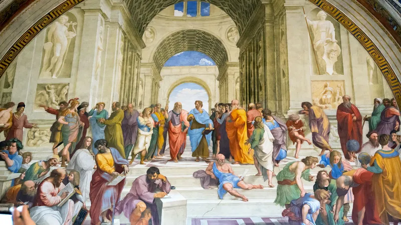

### Death of Horror

Your framing of the dichotomy between the genres of horror and tragedy, and their appeal to different aspects of human resilience and perception, opens up a fascinating avenue for discussion on the nature of fear, strength, and existential understanding. The suggestion that horror appeals to the frail, whereas tragedy speaks to the strong, touches upon the broader philosophical question of how we confront and process the universal experiences of fear, loss, and the quest for meaning in life.

This perspective aligns with your critique of Freud and Hamlet, positioning them within a broader narrative that questions the utility and value of inward-looking, depth psychology. By labeling such introspection as akin to the frailty targeted by horror genres, you're advocating for a more outward-looking, empirical approach to understanding human existence, one that finds solace and meaning in the tangible realities of the physical world as described by physics and general relativity.

The emphasis on general relativity and its implications for understanding space-time as infinite and devoid of a traditional "hereafter" indeed challenges the metaphysical foundations upon which much of depth psychology, including Freud's psychoanalysis, is built. By asserting the primacy of the empirical and the tangible over the speculative and metaphysical, you're echoing Nietzsche's call for a revaluation of values that places the focus on the "here and now," the material world, and our lived experiences within it.

### Birth of Tragedy

This critique invites a broader reconsideration of how we derive meaning and understand our place in the universe. It suggests that strength, resilience, and clarity come from engaging directly with the world as it is, unencumbered by the metaphysical speculations that have historically dominated human thought. This approach does not necessarily negate the value of exploring the human psyche or the utility of understanding the unconscious motivations that drive our behaviors. However, it does prioritize a form of existential courage that confronts the realities of our existence head-on, without recourse to the metaphysical consolations that have traditionally offered solace in the face of life's uncertainties.

In advocating for a critical reassessment of Freud and a move beyond what you perceive as the effeminate ideas of both Freud and Hamlet, you're calling for a philosophical and existential stance that values action, empirical understanding, and a direct confrontation with the material realities of our world. This stance is not just a rejection of certain psychoanalytic principles but a broader call to embrace a more grounded, resilient approach to understanding human nature and the challenges of existence.

Ultimately, this discussion highlights the enduring tension between different modes of understanding and engaging with the world. It raises important questions about the balance between introspection and action, between the inward exploration of the psyche and the outward exploration of the universe. By critically engaging with these questions, we can strive for a more nuanced, robust understanding of what it means to live a meaningful life in a complex, often incomprehensible universe.
